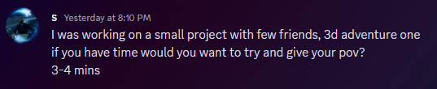
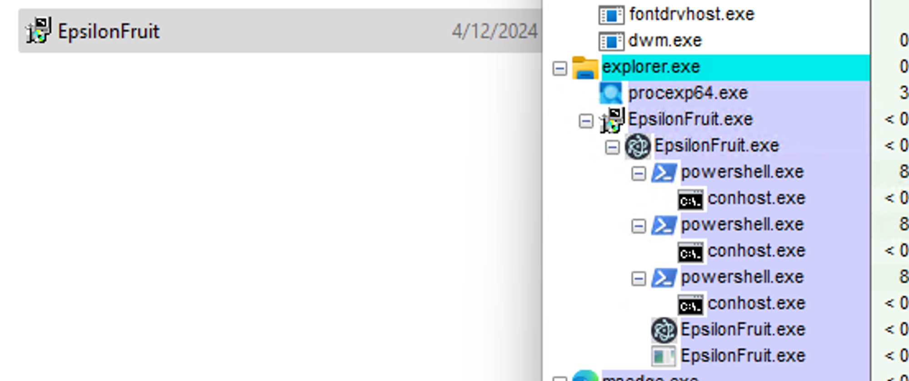

# Malware Analysis: Epsilon Fruit

by B4sicallyF0x

This malware is distributed through Discord. Let's see how it works.

First, a target is searched with the following message. Normally, they send this message to the entire list of friends of the accounts they are hacking

They tend to be quite rude if you say no.

If you say yes, they move on to the next stage.

Now, let's see and analyze the website they send us:

It looks like the website of a real game, but for example, we can notice that all the buttons and links lead to the same place

It's a little strange that the game is hosted on Discord's CDN, right? We'll talk about that later.

We can also realize that the game images are taken from another game, with a simple reverse image search

Now, let's analyze the supposed game, so let's download it

It's pretty light for a game, let's open it

It is password protected. It's not strange? It's a simple game! 

We ask for the password

Now that we have the file, let's inspect it. The first thing we can notice is that the antivirus does not detect it

So is it safe? Not really

Let's run it and see what happens

Well... it turns out that nothing happens. But if we check Process Explorer, we can see that the program has spawned PowerShell

At first glance, for the user, absolutely nothing happens. 

But just by opening the file, it already has all your data.

Here we have a screenshot of the information he obtained from us, provided by my friend Ivy, since the scammer sent it to him

As we can see, it obtained system information, cookies, and history, as well as saved passwords.
He also obtained the IP address, and managed to infect the Discord application.

He got the Discord account token, and also some 2-factor recovery codes, although we are not too sure, since he managed to change the password and email without any problem

However, it appears that the virus did not establish itself at startup.

…or so I thought

Another one? Let's run it too

This one looks different

But this other one seems to run more processes. And there is one in particular that attracts attention.

ScreenCapture? What is it doing? Obviously, as its name indicates, it is taking screenshots of our computer.

In fact, if we go to the temporary folder on our computer, we can find the screenshots

And this time, with this file, it is set to Windows startup

WindowsUpdater is a video game? LOL 🫠

But wait a moment. Where does all this information go?

Let's see it. We will use the Procmon tool (Process Monitor)

As we can see, the program is sending and receiving TCP requests to the IP “188.114.97.7”

This IP belongs to Cloudflare, so likely they’re using a server to receive all the data

I did some research into the code, and I managed to get the following domain

**vchaonlyone.com**

If we make a nsklookup in the domain, we get the following:

And we can verify that the IPs match the previous ones. So we can deduce that it is sending all the data to a server.

Why is this virus not detected by the antivirus? Because it is made with electron, which is a framework for making executable web applications. It's basically how discord works, that's why it goes unnoticed. I'm still researching how it works.

Although there is much more information that we can get, we will leave it here. Now the question is, what do they do with the accounts?

If we look at the previous screenshot, we notice that it said something about selling the information in a channel

With a simple lookup on Google, we manage to see the channel

And also, our recently stolen account, for sale

Which... is sold? Who bought it? And so fast?

If we go to the voucher channel, we can see the buyer's recent forwarded message

And, if we contact him…

250$?!? Personally I don't believe it, but it could be. Furthermore, he said that he bought it with LTC (litecoin, a type of cryptocurrency)

And who is responsible for all this?

Is the profile photo real? Not really, it’s on Pinterest

This is all I have for now. I will update this file as I research more. At the moment, I have issued a complaint to the Telegram group, the hosting provider, the domain provider, and Cloudflare, as well as Discord.

Below I leave a link to the sample files in case you want to investigate on your own. Keep in mind that they are viruses, so treat them with care and in a controlled space.

Password: b4sicallyf0x

[EpsilonVirusSamples.zip (workupload.com)](https://workupload.com/file/4fU2HnhnGyw)
